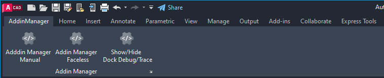
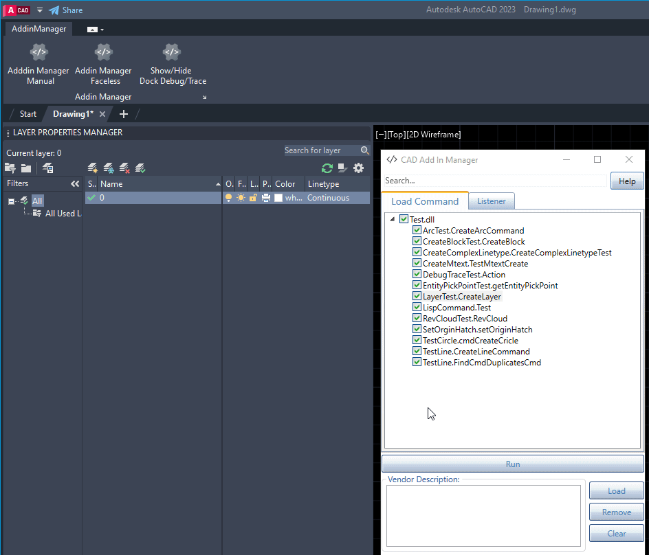
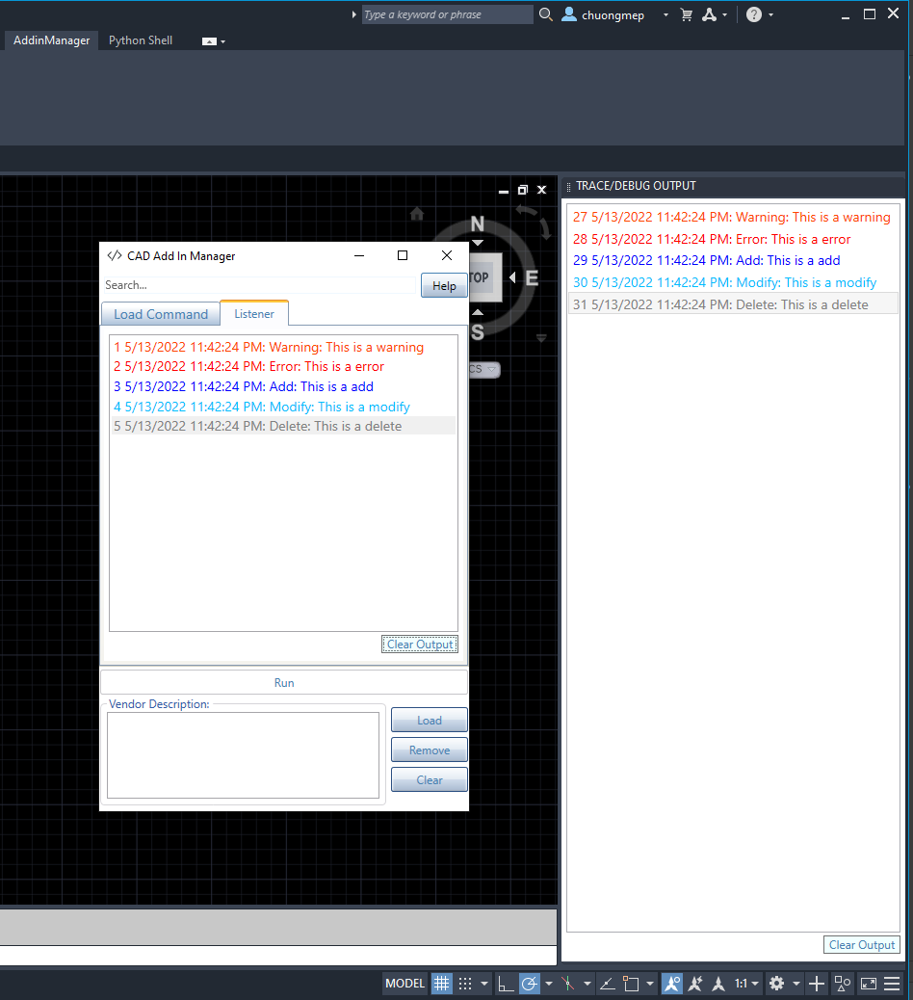

# Cad Add-in Manager

  [](https://opensource.org/licenses/MIT)

   

[](../../actions)
[]()
[](http://hits.dwyl.com/chuongmep/cadaddinmanager)
<a href="https://twitter.com/intent/follow?screen_name=chuongmep">
</a>


## Summary



Usually, when developing and debugging an addin with **Autocad** or **Civil3D** API, user has to close & re-open **Autocad** or **Civil3D** each time
he/she modifies the addin code and wants to re-compile. But with **Add-In Manager**, user can modify and run the Addin.
directly without closing & re-opening **Autocad** or **Civil3D** again and again.This is a next branch from [Revit Addin Manager](https://github.com/chuongmep/RevitAddInManager)
to support multiple platform API for developer. With current technology, you can use [Hot Reload](https://docs.microsoft.com/en-us/visualstudio/debugger/hot-reload?view=vs-2022) to speed it up.But try this project it will be faster with any Addin.

- [x] [Revit Add-In Manager](https://github.com/chuongmep/RevitAddInManager)

- [x] [Navis Add-In Manager](https://github.com/chuongmep/NavisAddInManager)

- [x] [Cad Add-In Manager](https://github.com/chuongmep/CadAddInManager)


Some feature include:
- A newbie can create a new Add-in and explore **AutoCAD or Civil3D API** easy with Add-in manager.
- Add-in tester(use Debug and Trace to test your add-in).
- **Debug / Trace** : Support Show result use [Debug](https://docs.microsoft.com/en-us/dotnet/api/system.diagnostics.debug?view=net-6.0) or [Trace](https://docs.microsoft.com/en-us/dotnet/api/system.diagnostics.trace?view=net-6.0) to show result in Autocad or Civil3D.
- Add-in manager
    - AddInManager Manual : Use for normal process load/unload addin
    - AddInManager Faceless : use for load last process before addin without UI
- Allow user know whether plugin can load successfully or not.
- <kbd>F5</kbd> - Load fresh plugin don't need load again.
- <kbd>F1</kbd> - Go link open source report some error,bug or feature request.
- <kbd>Delete</kbd> - Quick remove by use right click or use from keyboard.
- <kbd>Crt + MouseWheel</kbd> - Zoom in/out by use mouse wheel in command plugin.
- <kbd>Arrow Up</kbd> - Move from TreeView to search.
- <kbd>Arrow Down</kbd> - Move from search to TreeView.
- <kbd>Esc</kbd> - Quick Close Add-in Manager.
- <kbd>Enter</kbd> - Quick Run Execute a command selected in Add-in Manager.
## Add-In Manager



### Command

- [x] AddInManagerManual
- [x] AddInManagerFaceless

Execute a command easily  :
 1. Create a class library use .NET

 2. Add library Autocad API or Civil3D API

 3. Create a command, example:

 ```cs
    [CommandMethod("DoSomething")]
    public void Execute()
    {
        // do some thing code here
    }
 ```
 4.Load To Add-in Manager.

 5.Double click to run command.

 6.Use faceless when you change code or rebuild.

### Lisp Function
Execute a Lisp Function easily  :
1. Create a class library use .NET

2. Add library Autocad API or Civil3D API

3. Create a Lisp Function, example:

 ```cs
    [LispFunction("DisplayFullName")]
    public static void DisplayFullName(ResultBuffer rbArgs)
    {
        if (rbArgs != null)
        {
            string strVal1 = "";
            string strVal2 = "";
            int nCnt = 0;
            foreach (TypedValue rb in rbArgs)
            {
                if (rb.TypeCode == (int) LispDataType.Text)
                {
                    switch (nCnt)
                    {
                        case 0:
                            strVal1 = rb.Value.ToString();
                            break;
                        case 1:
                            strVal2 = rb.Value.ToString();
                            break;
                    }
                    nCnt = nCnt + 1;
                }
            }
            Application.DocumentManager.MdiActiveDocument.Editor.WriteMessage("\nName: " + strVal1 + " " + strVal2);
            MessageBox.Show("Updated");
        }
    }
 ```
4.Load To Add-in Manager.

5.Use Reload when you change code or rebuild.

6.Run Lisp Function [example](https://github.com/chuongmep/CadAddinManager/blob/9982d2a2b32591f508c0ce0e55e0d636ba38092c/Test/FunctionLispTest.cs#L9-L34) : `(displayfullname "First" "Last") `

### Trace/Debug

- [x] Show/Hide result inside Dockpanel Autocad and Civil3D.
- [x] Show Result history inside CadAddinManager.
- [x] Clear Result.
- [X] Show Result by color.

A sample command to execute:
```csharp
using System.Diagnostics;
using Autodesk.AutoCAD.Runtime;
public class DebugTraceTest
{
    [CommandMethod("DebugTraceTest")]
    public void Action()
    {
        //Trace or Debug Something
        Trace.WriteLine($"Warning: This is a warning");
        Trace.WriteLine($"Error: This is a error");
        Trace.WriteLine($"Add: This is a add");
        Trace.WriteLine($"Modify: This is a modify");
        Trace.WriteLine($"Delete: This is a delete");
    }
}
```


## Installation

Please follow last release at section [Release](https://github.com/chuongmep/CadAddInManager/releases/latest)

Support Autocad or Civil3D Version : 2020, 2021, 2022, 2023, 2024, 2025
---

## Guideline

You can visit to wiki and read document or access by this [link](https://github.com/chuongmep/CadAddInManager/wiki).

---

## Author

Originally implemented by [ChuongHo](https://github.com/chuongmep) with platform **WPF** and add more feature to fit
with the progressive development of modern technology. His focus is to work smarter and achieve the most effective
practices to enhance data utilization and digital collaboration among AEC parties.

---

## License

This sample is licensed under the terms of the [MIT License](http://opensource.org/licenses/MIT). Please see
the [License](License.md) file for full details.

---

## Contribute

**Add-In Manager** is an open-source project and would _be_ nothing without its community. You can make suggestions or
track and submit bugs via Github [issues](https://docs.github.com/en/issues/tracking-your-work-with-issues/creating-an-issue). You can submit your own code to the **Add-In Manager** project via a
Github [pull request](https://docs.github.com/en/pull-requests/collaborating-with-pull-requests/proposing-changes-to-your-work-with-pull-requests/about-pull-requests)
.

Many Thanks all contributors for this repository. Feel free to contribute!
Please refer to the [CONTRIBUTING](CONTRIBUTING.md) for details.

<a href = "https://github.com/chuongmep/CadAddInManager/graphs/contributors">
  
</a>

---

## Sponsors


Thanks for providing a free All product IDE for this project.

---

## Credits

- Credit to [Chuongmep](https://github.com/chuongmep)
- Credit to [icons8.com](https://icons8.com) for the Cad Add-in Manager icons.
- Credit to [Nice3point](https://github.com/Nice3point) for the CI/CD template.

## Known Issues

- [Ribbon not show when open startup Autocad or Civil3d](https://github.com/chuongmep/CadAddinManager/wiki/Fix-Problem-Ribbon-Not-Show).

- Cad Add-in Manager current not support for some product custom of Autocad like **CadMEP** or **Advance steel**.

## Learning Resources

- <a href="https://adndevblog.typepad.com/autocad/" target="_blank">ADN Dev Blog</a>
- <a href="https://www.autodesk.com/developer-network/platform-technologies/autocad" target="_blank">AutoCAD Developer Center</a> 
